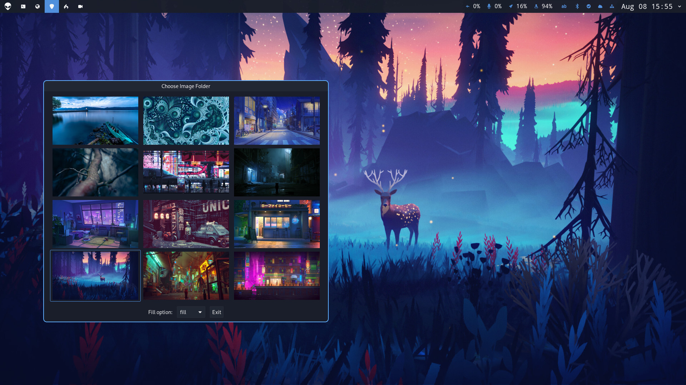

# Waypaper

GUI wallpaper setter for Wayland and X11 window managers. It works as a frontend for popular wallpaper backends like `swaybg`, `swww`, `wallutils` and `feh`. You can check a [demo on reddit](https://www.reddit.com/r/unixporn/comments/15lbhuc/hyprland_waypaper_gui_wallpaper_setter_for_wayland/).

## Features

- GUI wallpaper selection
- Support for GIF animations (with `swww`)
- Works on both Wayland (with `swaybg` or `swww` or `wallutils`) and Xorg (with `feh` or `wallutils`)
- Restores wallpaper at launch of your WM
- Caching for fast loading
- Vim keys
  
## Installation

You need to install at least one of the backends and Waypaper, which works as a frontend.

### 1. Install a backend

Install a preferred backend from your package manager: [swaybg](https://github.com/swaywm/swaybg) or [swww](https://github.com/Horus645/swww) on Wayland or [feh](https://github.com/derf/feh) on Xorg or [wallutils](https://github.com/xyproto/wallutils) on both.

### 2. Install Waypaper

Waypaper is available as a package in different repositories listed below:

#### From PyPi

`pipx install waypaper`

If `pipx` is not found, you first need to install `pipx` from your package manager, it's sometimes called `python-pipx`.

#### From AUR

`yay -S waypaper-git`

The [waypaper-git](https://aur.archlinux.org/packages/waypaper-git) package is available in AUR, thanks to *metak*. Please upvote to support the project.

### Dependencies

- `swaybg` or `swww` or `feh` or `wallutils`
- gobject python library (it might be called `python-gobject` or `python3-gi` or `python3-gobject` in your package manager.)

## Usage

`waypaper` command will run GUI application. Make sure to choose the backend that you installed.

To restore your wallpaper at launch, add `waypaper --restore` to your startup config. For example:

**In Hyprland**

`exec-once=waypaper --restore`

**In Sway or I3**

`exec waypaper --restore`
 
 To see the list of hotkeys, press `?`.

### Options

`--restore` - sets the last chosen wallpaper. Useful at launch of the window manager.

`--backend XXX` - specifies which backend to use, which can be either `swaybg`, `swww`, `feh`, or `wallutils`. Useful if you use waypaper on both Wayland and Xorg on the same machine. By default, last used backend is used.

`--fill XXX` - specifies filling type, which can be eiher `fill`, `stretch`, `fit`, `center`, or `tile`.

## Troubleshooting

- If waypaper always looses focus on Hyprland try to add this to your config `windowrulev2 = stayfocused, class:(waypaper)
`. However, other issues might occur.
- If wallpaper does not change, first, try to launch waypaper in the terminal and see the output. Also, try to change it via command line using chosen backend to make sure that backend by itself works correctly.
- If application does not run, make sure to install `gobject` library (it might be called `python-gobject` or `python3-gi` in your package manager). Although it is supposed to be installed automatically with the package.
- Please understand that not all backends work on all systems. `feh` is only for Xorg, while `swww` and `swaybg` are only for Wayland.
- If you use different WMs on the same system, specify the backend when you restore the wallpaper at launch. For example: `waypaper --restore --backend feh` or use `wallutils` which works on both Wayland and Xorg.

## Roadmap

- ~Improve loading of folders with many images~.
- Additional options for ~search in subfolders~, ~background color~, ~sorting~, and setting a uniform color.
- Support for other backends like ~swww~, ~feh~, ~wallutils~, wbg, and hyprpaper.
- ~Better keyboard-driven experience and hjkl support.~
- Support for multiple monitors

## Contributions

Feel free to propose PR and suggest the improvements. I'll also appreciate any help with packaging for various distributions.

If you'd like to support the development, consider [donations](https://www.buymeacoffee.com/angryprofessor).
